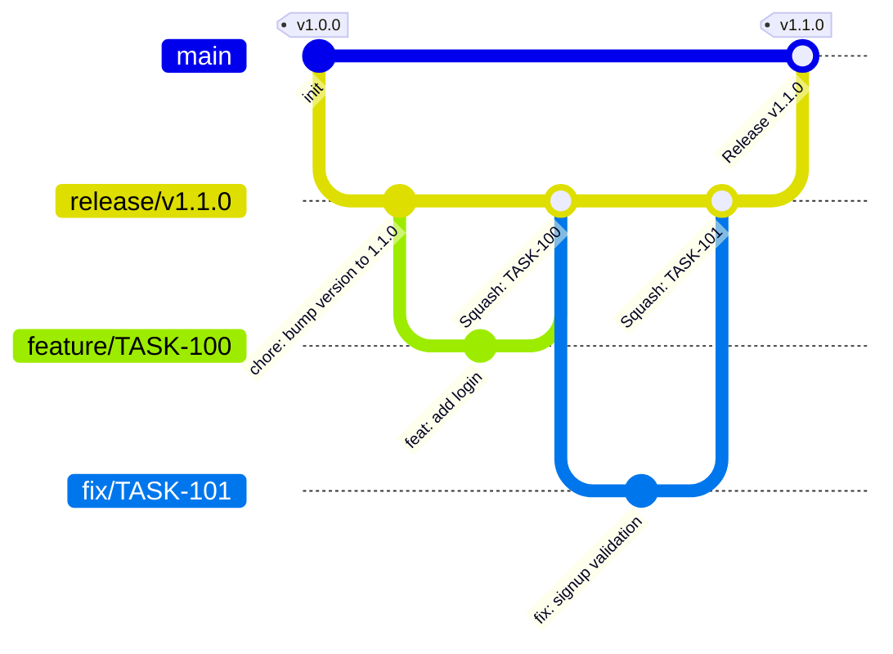

# Git Flow Next 온보딩 가이드

> 📌 이 레포는 **git-flow-next** 기반의 커스텀 브랜치 전략을 사용합니다. 클론 후 아래 설정을 먼저 완료해주세요.

---

## 최초 설정

**사전 설치 필요**

**macOS**
```bash
brew install git-flow-next   # git-flow-next CLI
brew install gh              # GitHub CLI
gh auth login                # GitHub CLI 로그인
```

**Linux**
```bash
# git-flow-next CLI
curl -fsSL https://raw.githubusercontent.com/gittower/git-flow-next/main/install.sh | bash

# GitHub CLI
apt install gh

# GitHub CLI 로그인
gh auth login
```

처음 레포를 클론한 뒤 아래 명령어 한 번으로 git-flow-next 환경이 구성됩니다.

```bash
bash scripts/setup-gitflow.sh
```

---

## 브랜치 전략



| **브랜치** | **분기 기준** | **용도** | **머지 대상** | **머지 방식** |
|---|---|---|---|---|
| `main` | — | 운영(OP) 배포 브랜치 | — | — |
| `release/vx.y.z` | 최신 main | 릴리즈 단위 작업 통합 | main | 3-way Merge |
| `feature/task-id` | 지정한 release 브랜치 | 신규 기능 개발 | 해당 release 브랜치 (GitHub PR) | Squash Merge |
| `fix/task-id` | 지정한 release 브랜치 | 버그 수정 (릴리즈 단위) | 해당 release 브랜치 (GitHub PR) | Squash Merge |

> 💡 **왜 develop 브랜치가 없나요?**
>
> develop 브랜치는 다수의 개발자가 많은 환경에서 release 브랜치와 병렬로 운영하여, 특정 작업은 이번 릴리즈에 넣고 다른 작업은 다음 릴리즈에 넣는 병렬화를 위해 사용됩니다.
>
> 현재 프로젝트에서는 버전별로 기획상 필요한 기능들이 명확히 정의되어 있고, 해당 기능 이외의 작업은 구현하지 않습니다. 따라서 develop을 별도로 둘 필요 없이, release 브랜치를 생성한 후 해당 버전의 모든 작업을 해당 release 브랜치에 머지하는 방식으로 운영합니다.

---

## Release 브랜치

### 생성

```bash
git flow release start <version>
```

**예시**
```bash
git flow release start v1.1.0
```

**자동으로 수행되는 작업 (훅)**

1. 원격 `main`을 fetch하여 로컬 `main`을 최신 상태로 갱신
2. `release/v1.1.0` 브랜치를 최신 `main`에서 생성
3. `package.json`의 `version` 필드를 `1.1.0`으로 변경 후 자동 커밋

### 종료 (Finish)

```bash
git flow release finish <version>
```

**예시**
```bash
git flow release finish v1.1.0
```

**자동으로 수행되는 작업 (훅)**

| **상황** | **동작** |
|---|---|
| GitHub PR로 이미 머지된 경우 | main 기준으로 `v1.1.0` 태그 생성 + GitHub Release 생성 후 종료 |
| 아직 머지되지 않은 경우 | release → main 머지 + `v1.1.0` 태그 생성 + GitHub Release 생성 |

GitHub Release에는 이전 태그 이후의 커밋 목록이 커밋 링크와 함께 자동으로 포함됩니다.

> 💡 GitHub PR로 머지한 경우에도 `git flow release finish`를 실행하면 태그가 자동으로 생성됩니다. 중복 머지는 발생하지 않습니다.

---

## Feature 브랜치

### 생성

feature 브랜치는 **반드시 release 브랜치를 base로 지정**해야 합니다.

```bash
git flow feature start <name> <release/vx.y.z>
```

**예시**
```bash
git flow feature start TASK-100 release/v1.1.0
```

release 브랜치를 생략하거나 release 이외의 브랜치를 지정하면 오류가 발생합니다.

```bash
# 오류: release 브랜치 미지정
git flow feature start TASK-100

# 오류: release가 아닌 브랜치 지정
git flow feature start TASK-100 main
```

### 종료

`git flow feature finish`는 이 프로젝트에서 **사용이 차단**되어 있습니다. 작업이 완료되면 아래 순서로 진행합니다.

1. `git push origin feature/<name>` 으로 원격에 푸시
2. GitHub에서 base를 해당 `release/vx.y.z` 브랜치로 지정하여 PR 생성
3. 코드 리뷰 후 GitHub에서 머지

---

## Fix 브랜치

feature와 동일한 규칙이 적용됩니다. 릴리즈 단위의 버그 수정에 사용합니다.

### 생성

```bash
git flow fix start <name> <release/vx.y.z>
```

**예시**
```bash
git flow fix start TASK-101 release/v1.1.0
```

### 종료

`git flow fix finish`는 이 프로젝트에서 **사용이 차단**되어 있습니다. 작업이 완료되면 아래 순서로 진행합니다.

1. `git push origin fix/<name>` 으로 원격에 푸시
2. GitHub에서 base를 해당 `release/vx.y.z` 브랜치로 지정하여 PR 생성
3. 코드 리뷰 후 GitHub에서 머지

---

## Hotfix 브랜치

> ⚠️ **Hotfix 브랜치는 이 프로젝트에서 사용이 차단되어 있습니다.**

긴급 수정이 필요한 경우에도 release 브랜치를 사용합니다.

```bash
git flow release start <version>
```

---

## 자주 쓰는 명령어 요약

```bash
# Release
git flow release start v1.1.0
git flow release finish v1.1.0

# Feature (finish 명령 없음 — GitHub PR로 마무리)
git flow feature start TASK-100 release/v1.1.0

# Fix (finish 명령 없음 — GitHub PR로 마무리)
git flow fix start TASK-101 release/v1.1.0

# 현재 브랜치 기준 단축 명령어
git flow publish    # 현재 브랜치 원격 푸시
git flow update     # 부모 브랜치 변경사항 반영
```
